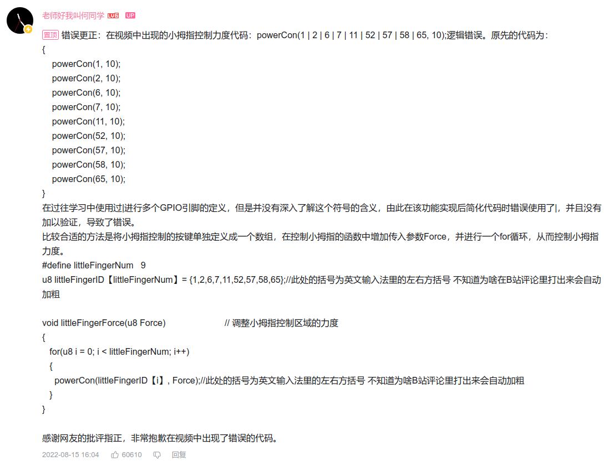
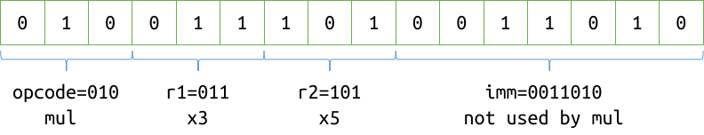

# CS100 Recitation 5

GKxx

---

## 目录

- 重定向与文件 IO
- `struct`
- `enum`, bitfield, `union`

---

# 重定向与文件 IO

---

## 输入流、输出流

“流” (stream) ：这些字符像水流一样，流过便不再回头。

`stdin`, `stdout` ： 标准输入流、标准输出流

- 当我们在终端运行一个程序的时候，在默认情况下， `stdin` 和 `stdout` 都被绑定到这个终端。
- `./program < my_input_file.txt` ： 将 `stdin` **重定向**到 `my_input_file.txt`
- `./program > my_output_file.txt` ： 将 `stdout` **重定向**到 `my_output_file.txt`
  - 如果这个文件不存在，就创建出来。
  - 如果这个文件存在，它原有的内容会被覆盖掉。
  - `./program >> my_output_file.txt` ： 追加，而非覆盖。
- `./program < testcases/3.in > output.txt`

---

## [`freopen`](https://en.cppreference.com/w/c/io/freopen): 在代码中实现“重定向” (redirect)

```c
freopen("testcases/3.in", "r", stdin);
freopen("output.txt", "w", stdout);
```

<div align="center">

| File access mode string | meaning         | explanation                  |
| ----------------------- | --------------- | ---------------------------- |
| `"r"`                   | read            | open a file for reading      |
| `"w"`                   | write           | create a file for writing    |
| `"a"`                   | append          | append to a file             |
| `"r+"`                  | read extended   | open a file for read/write   |
| `"w+"`                  | write extended  | create a file for read/write |
| `"a+"`                  | append extended | open a file for read/write   |

</div>

---

## [`freopen`](https://en.cppreference.com/w/c/io/freopen): 在代码中实现“重定向” (redirect)

```c
freopen("testcases/3.in", "r", stdin);
freopen("output.txt", "w", stdout);
```

事实上 `freopen` 能做的不止是给 `stdin` / `stdout` 重定向！

**永远不要仅凭课件上的只言片语和例子学习标准库函数。**

---

## 标准输入、输出流

`scanf`, `printf`, `getchar`, `putchar`, `puts` 这些函数都使用 `stdin` 和 `stdout` 。

例如，

- 如果在使用 `scanf` 前将 `stdin` 重定向到某个文件， `scanf` 就会从那个文件读入。
- 如果在使用 `puts` 前将 `stdout` 重定向到某个文件， `puts` 就会向那个文件写入。

---

## 文件 IO

```c
FILE *infile = fopen("relative/path/to/my/input/file", "r");
int a, b;
fscanf(infile, "%d%d", &a, &b);
FILE *outfile = fopen("relative/path/to/my/output/file", "w");
fprintf(outfile, "%d\n", a + b);
fclose(infile);
fclose(outfile);
```

- `fopen` ：打开一个文件，获得一个 `FILE *` （文件指针）。
- `fclose` ：关闭一个文件。参数是一个 `FILE *` 。
- `fscanf`, `fprintf`, `fputs`, `fgets`, `fputc`, `fgetc` ：在原来的函数的基础上，多传一个 `FILE *` 类型的参数。
  - 如果传入 `stdin` / `stdout` ，它就和普通的版本一样了。

---

# `struct`

---

## `struct`

把几个东西结合在一起，定义成一个新的数据结构

<div style="display: grid; grid-template-columns: 1fr 1fr 1fr;">
  <div>

```c
struct Student {
  const char *name;
  const char *id;
  int entrance_year;
  int dorm;
};
```
  </div>
  <div>

```c
struct Record {
  void *ptr;
  size_t size;
  int line_no;
  const char *file_name;
};
```
  </div>
  <div>

```c
struct brainfuck_state {
  uint8_t *memory_buffer;
  size_t offset;
  // ...
};
```
  </div>
</div>

<div style="display: grid; grid-template-columns: 1fr 1fr;">
  <div>

```c
struct Point3d {
  double x, y, z;
}; 
```
  </div>
  <div>

```c
struct Line3d {
  struct Point3d p0, direction;
};
```
  </div>
</div>

---

## Product type

假设 `struct X` 具有如下成员

```c
struct X {
  T_1 mem_1;
  T_2 mem_2;
  // ...
  T_n mem_n;
};
```

设类型 $T_1,T_2,\cdots,T_n$ 的值的集合分别为 $\mathcal T_1,\mathcal T_2,\cdots,\mathcal T_n$ ，则 `struct X` 的值的集合为

$$
\mathcal X=\mathcal T_1\times\cdots\times\mathcal T_n=\left\{\left(t_1,\cdots,t_n\right)\mid t_1\in\mathcal T_1,\cdots,t_n\in\mathcal T_n\right\}
$$

---

## `struct` 类型

`struct` + 名字。C 中 `struct` 关键字不可省略，C++ 中必须省略。

```c
struct Student student;
struct Record records[1000];
```

### `typedef` 定义类型别名

```c
typedef long long LL;
typedef struct { double x, y, z; } Point3d;

LL llval = 0; // llval is long long
Point3d p;
```

**不要用 `#define` 代替 `typedef`**

---

## `struct` 的成员

`name.mem`

```c
struct Student student;
student.name = "Alice";
student.id = "2023533000";
student.entrance_year = 2023;
student.dorm = 8;
printf("%d\n", student.dorm);
++student.entrance_year;
puts(student.name);
```

---

## `struct` 的成员

`ptr->mem`：等价于 `(*ptr).name`。**不是 `*ptr.name` ！！**（`.` 优先级高于 `*`）

```c
struct Student *ptr = &student;
ptr->name = "Alice";
ptr->id = "2023533000";
(*ptr).entrance_year = 2023; // equivalent to ptr->entrance_year = 2023;
ptr->dorm = 8;
printf("%d\n", ptr->dorm);
++ptr->entrance_year;
puts(ptr->name);
```

---

## `struct` 初始化

老生常谈的问题：不显式初始化时会发生什么？

```c
struct Student gs;
int main(void) {
  struct Student ls;
}
```

---

## `struct` 初始化

老生常谈的问题：不显式初始化时会发生什么？

```c
struct Student gs;
int main(void) {
  struct Student ls;
}
```

- 全局或局部 `static`：**空初始化**：结构体的所有成员都被空初始化。
- 局部非 `static`：不初始化，所有成员都具有未定义的值。

---

## `struct` 的初始化

Initializer list:

```c
struct Record r = {p, cnt * each_size, __LINE__, __FILE__};
```

隔壁 C++20 才有的 designators，C99 就有了！（是不是非常像 Python？）

```c
struct Record r2 = {.ptr = p, .size = cnt * each_size,
                    .line_no = __LINE__, .file = __FILE__};
```

C 允许 designators 以任意顺序出现，C++不允许。

---

## `struct` 的初始化

```c
struct Record r = {p, cnt * each_size, __LINE__, __FILE__};
struct Record r2 = {.ptr = p, .size = cnt * each_size,
                    .line_no = __LINE__, .file = __FILE__};
```

**赋值**不行：

```c
r = {p, cnt * each_size, __LINE__, __FILE__};         // Error
records[i] = {.ptr = p, .size = cnt * each_size,
              .line_no = __LINE__, .file = __FILE__}; // Error
```

但可以使用 **compound literal** ：

```c
r = (struct Record){p, cnt * each_size, __LINE__, __FILE__};         // OK
records[i] = (struct Record){.ptr = p, .size = cnt * each_size,
                             .line_no = __LINE__, .file = __FILE__}; // OK
```

---

## 拷贝一个 `struct`

一个 `struct` 可以被拷贝，其行为是**逐成员**拷贝。

```c
struct Student a = {"Alice", "2023533000", 2023, 8};
struct Student b = a; // OK，初始化
struct Student c = something();
c = a; // OK，赋值
```

- ```c
  // struct Student b = a; 就如同下面的代码
  struct Student b = {a.name, a.id, a.entrance_year, a.dorm};
  ```
- ```c
  // c = a; 就如同下面的代码
  c = (struct Student){a.name, a.id, a.entrance_year, a.dorm};
  ```

---

## 拷贝一个 `struct`

```c
struct A {
  int array[10];
  // other members ...
};
```

虽然编译器拒绝直接拷贝数组，但它其实有能力做到。

拷贝一个 `struct A` 时，编译器会自动逐元素拷贝数组。

<div style="display: grid; grid-template-columns: 1fr 1fr;">
  <div>

```c
int a[10];
int b[10] = a; // Error!
```
  </div>
  <div>

```c
struct A a;
struct A b = a; // OK
```
  </div>
</div>

---

## 在函数之间传递 `struct`

传参的语义是**拷贝**。

```c
void print_info(struct Record r) {
  printf("%p, %zu, %d, %s\n", r.ptr, r.size, r.line_no, r.file_name);
}

print_info(records[i]);
```

传参时发生了这样的**初始化**，也就是逐成员拷贝

```c
struct Record r = records[i];
```

就如同

```c
struct Record r = {records[i].ptr, records[i].size,
                   records[i].line_no, records[i].file_name};
```

---

## 在函数之间传递 `struct`

返回一个 `struct`：严格按照语法来说，也是**拷贝**：

```c
struct Record fun(void) {
  struct Record r = something();
  some_computations(r);
  return r;
}

records[i] = fun();
```

`return r;`：发生了形如 `struct Record tmp = r;` 的**拷贝**，临时对象 `tmp` 是表达式 `fun()` 的求值结果。然后发生了形如 `records[i] = tmp;` 的**拷贝**。

**但实际上这个过程会被编译器优化，标准也是允许这种优化的。**（我们以后在 C++ 里进一步讨论这个问题）

---

## `struct` 的大小

```c
struct A {
  int x;
  char y;
  double z;
};
```

`sizeof(struct A)` 是多少？

---

## `struct` 的大小

```c
struct A {
  int x;
  char y;
  double z;
};
```

`sizeof(struct A) >= sizeof(int) + sizeof(char) + sizeof(double)`。由于内存对齐的问题，编译器可能会在某些地方插入一定的空白。

一般地，对于一个 `struct X` ，有

$$
\mathtt{sizeof(struct\ X)}\geqslant \sum_{\mathtt{member}\in\mathtt{X}}\mathtt{sizeof(member)}.
$$

---

## `struct` 的大小

```c
struct A {
  int x;
  struct A a;
};
```

`sizeof(struct A)` 是多少？

---

## `struct` 的大小

```c
struct A {
  int x;
  struct A a; // Error: use of incomplete type 'struct A'.
};
```

`sizeof(struct A)`$=+\infty$。因此这种行为是**不允许的**。

- 从物理上讲：这样的东西无法存储。
- C 类型系统认为：在定义完毕之前，这个类型是**不完全类型** (incomplete type)。对于不完全类型，不能定义这个类型的对象，不能访问这个类型的成员，只能定义这个类型的指针，并且不能解引用。

---

## 常见问题：如何返回两个值/多个值？

<div style="display: grid; grid-template-columns: 1fr 1fr;">
  <div>

```c
??? minmax(int *array, int n) {
  int min = INT_MAX;
  int max = INT_MIN;
  for (int i = 0; i < n; ++i) {
    // ...
  }
  return /* (min, max) */
}
```

  </div>
  <div>

```c
??? read_string(void) {
  char *buffer = /* ... */;
  size_t size = 0;
  // read the string ...
  
  buffer[size] = '\0';
  return /* (buffer, size) ? */
}
```
  </div>
</div>

“返回一个值”：将信息从函数内传给调用者。

- 除了 `return` ，还有什么办法可以传递这个信息？

---

## 除了 `return` ，还有什么办法可以把信息传给调用者？

让调用者把存放结果的内存地址传进来，我往那儿写。

<div style="display: grid; grid-template-columns: 1fr 1fr;">
  <div>

```c
int add(int a, int b) {
  return a + b;
}
int main(void) {
  int sum = add(1, 2);
}
```
  </div>
  <div>

```c
void add(int a, int b, int *result) {
  *result = a + b;
}
int main(void) {
  int sum;
  add(1, 2, &sum);
}
```
  </div>
</div>

---

## 传递存放结果的内存地址

```c
void minmax(int *array, int n, int *min, int *max) {
  *min = INT_MAX;
  *max = INT_MIN;
  for (int i = 0; i < n; ++i) {
    // 对 *min 和 *max 进行修改
  }
}
int main(void) {
  int a[] = {1, 2, 3};
  int min, max;
  minmax(a, 3, &min, &max);
}
```

想“返回”多少个值都可以：

```c
void minmax(int *array, int n, int *min, int *max, int *secmin, int *secmax);
```

---

## 传递存放结果的内存地址

还可以与 `return` 结合使用：

```c
char *read_string(size_t *size) {
  char *buffer = /* ... */;
  *size = 0;
  // read the string ...
  // ++*size whenever a new character is read and stored.
  buffer[*size] = '\0';
  return buffer;
}
int main(void) {
  size_t size;
  char *string = read_string(&size);
}
```

但像 `minmax` 这样的函数，返回的两个值“地位对等”，不建议用两种不同的方式。

---

## 更直接： `return` 一个 `struct`

C 没有内置的“元组” (tuple) ，但它可以轻易用 `struct` 造出来：

```c
struct minmax_result { int min; int max; };

struct minmax_result minmax(int *array, int n) {
  int min = INT_MAX;
  int max = INT_MIN;
  // ...
  return (struct minmax_result){min, max};
}

int main(void) {
  int a[] = {1, 2, 3};
  struct minmax_result minmax = minmax(a, 3);
  int min = minmax.min, max = minmax.max;
}
```

练习：用这种方式改写 `read_string`

---

## 逗号运算符

一些来自其他语言的选手可能会想这么写：

```c
int minmax(int *array, int n) {
  // ...
  return min, max;
}
```

它真的能通过编译，但效果就是 `return max;`

- 表达式 `expr1, expr2` 中的 `,` 是**逗号运算符**：先对 `expr1` 求值，再对 `expr2` 求值，返回 `expr2` 的值。优先级最低的运算符。
  - 为数不多的运算对象求值顺序能确定的运算符之一。
- 并非所有逗号都是逗号运算符，例如 `func(a, b, c)` 中的逗号是函数调用传参的语法的一部分， `int a, b;` 中的逗号是声明多个变量的语法的一部分。

---

## 标准库的相关设计

`strtol` ：将一个以字符串形式存在的整数的数值提取出来（得到一个 `long`）。

```c
long strtol(const char *str, char **str_end, int base);
```

```c
char str[] = "1234abcdef";
char *next_pos;
long value = strtol(str, &next_pos, 10);
// value 是 1234 ， next_pos 指向 'a'
```

> The functions set the pointer pointed to by `str_end` to point to the character past the last numeric character interpreted. If `str_end` is a null pointer, it is ignored.

`strtoll`, `strtod` 等函数也是这样。

---

## 怎样设计一个函数，让它修改一个变量？

**要么 `x = f(x)` ，要么 `f(&x)` 。**

<div style="display: grid; grid-template-columns: 1fr 1fr;">
  <div>

```c
const char *move_forward(const char *s)
{
  while (*s != '\0' && condition(*s))
    ++s;
  return s;
}

// call site:
ptr = move_forward(ptr);
```
  </div>
  <div>

```c
void move_forward(const char **s)
{
  while (**s != '\0' && condition(**s))
    ++*s;
}

// call site:
move_forward(&ptr);
```
  </div>
</div>

---

# `enum`, bitfield, `union`

---

## `enum`

定义一个新的类型，其值是某几个特定的（有名字的）值之一。

<div style="display: grid; grid-template-columns: 1fr 1fr;">
  <div>

```c
struct Text {
  int color; // 0 黑色, 1 红色, 2 绿色
  char *contents;
};

// in some function
struct Text text = something();
text.color = 0; // 设为黑色
```

- 不好的设计：使用 magic numbers
  </div>
  <div>

```c
enum TextColor { Black, Red, Green };
struct Text {
  enum TextColor color;
  char *contents;
};

// in some function
struct Text text = something();
text.color = Black;
```

- 好的设计：使用 `enum` 。
  </div>
</div>

---

## `enum` 实际上也是一种整数

```c
const char *colorToString(enum TextColor color) {
  switch (color) { // 可以放在 switch 里
    // enum items 是整型编译期常量，可以放在 case label 上
    case Black: return "Black";
    case Red:   return "Red";
    case Green: return "Green";
    default:    return "unknown color";
  }
}
```

```c
const char *colorToString(enum TextColor color) {
  const char *colors[] = {"Black", "Red", "Green"};
  return colors[color]; // color 可以作为下标
}
```

- 你觉得哪一种写法更好？

---

<a align="center" href="https://www.bilibili.com/video/BV1W14y1b7Mq">
  
</a>

---

## Bitfield

注意：以下代码的行为是 implementation-dependent 的

```c
struct Instruction {
  unsigned imm : 7;
  unsigned r2 : 3;
  unsigned r1 : 3;
  unsigned opcode : 3;
}; // sizeof(struct Instruction) == 7 + 3 + 3 + 3
```

<a align="center">
  
</a>

```c
unsigned short x; scanf("%hx", &x);
struct Instruction i= *(struct Instruction *)&x;
// 现在可以直接使用 i.opcode, i.r1, i.r2, i.imm
```

---

## `union`

`union` 和 `struct` 一样，也有一系列**成员**。不同的是， `union` 是这些成员的“叠加”，这些成员共用一片内存。

- `struct`: "Cartesian product"
  
  $$
  \mathcal X=\mathcal T_1\times\cdots\times\mathcal T_n=\left\{\left(t_1,\cdots,t_n\right)\mid t_1\in\mathcal T_1,\cdots,t_n\in\mathcal T_n\right\}
  $$

  $$
  \mathtt{sizeof(struct\ \ X)}\geqslant\sum_{\mathtt{member}\in\mathtt{X}}\mathtt{sizeof(member)}.
  $$

- `union`: (almost) "disjoint union"
  
  $$
  \mathcal X=\mathcal T_1\sqcup\cdots\sqcup\mathcal T_n=\left\{\left(t_i,i\right)\mid t_i\in\mathcal T_i,i\in\{1,\cdots,n\}\right\}
  $$

  $$
  \mathtt{sizeof(union\ \ X)}\geqslant\max_{\mathtt{member}\in\mathtt{X}}\mathtt{sizeof(member)}.
  $$

使用 `union` 要非常小心。
